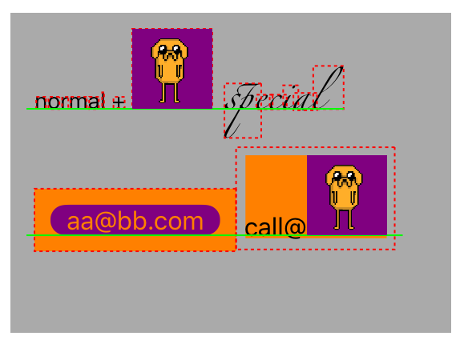

## XLYTextKitExtension

TextKit is complicate but powerful. it adds attachement for drawing images alongside the text. 
but everything is drawing, no view can be layout with text.

**XLYTextKitExtension** adds the ability to TextKit for layouting text and views together. 

It uses `NSTextAttachment` to do such things. view or text can be embeded in an attachment to act as one `glyph`.
**background** and **forground** of glyphs also has a chance to draw your custom things, just add an `XLYPainter` to the `AttributedText`.

many helper draw functions are provided, you can write your own if you need.

## quick look

it's all the familiar way to create an attachment or add an attribute. `XLYTextAttachment` is a subclass of `NSTextAttachment`.

the dog is crouching down and up. see the demo for effect. here is just a static image. text is editable.



1. add view

```swift
let gifAttachment = XLYTextAttachment { () -> UIView in
    let animatedImageView = UIImageView()
    animatedImageView.backgroundColor = .purpleColor()
    animatedImageView.animationImages = images
    animatedImageView.animationDuration = 0.6
    animatedImageView.startAnimating()
    return animatedImageView
}

// can adjust origin as you wish, just same as normal attachment config
gifAttachment.bounds = CGRectMake(0, 0, 50, 50)

let text = NSAttributedString(attachment: gifAttachment)
```

2. custom paint as glyph
```swift
let painterAttachment = XLYTextAttachment { (context: CGContext, rect: CGRect) in
	// you can draw whatever you want
    UIColor.redColor().setFill()
    CGContextFillRect(context, rect) 
}

let text = NSAttributedString(attachment: gifAttachment)
```

3. `XLYTextAttachment` still can be used as `NSTextAttachment`. it does not change anything.
```swift
// just create as if it is NSTextAttachment
let imageAttachment = XLYTextAttachment()
imageAttachment.image = UIImage(named: "dog0")

let text = NSAttributedString(attachment: gifAttachment)
```

4. combine some text as one glyph
```swift
let combined1Attachment = XLYTextAttachment(string: "kaizei@site.com",
                                            lineFragmentPadding: 10,
                                            insets: UIEdgeInsets(top: 10, left: 10, bottom: 10, right: 10),
                                            baselineMode: .LineUsedRectBottom(diff: 0))
let text = NSAttributedString(attachment: combined1Attachment)
```

5. add background and forground paint

there is a enum 'XLYPainter.PainterType' containing `Background` and `Foreground`.

```swift
// fillLineUsedRect is a helper method, it returns a function handling how to draw.
let backgroundPainter = XLYPainter(type: .Background, handler: fillLineUsedRect(UIColor.purpleColor(), cornerFactor: 0.5))

// another helper method. draws the glyph outline.
let outlinePainter = XLYPainter(type: .Foreground, handler: strokeOutline(UIColor.redColor(), lineDashLengths:[2, 2]))

// create attributes as you always do. key canbe any string.
let attributes = [ "your.painter.key.background": backgroundPainter,
					"another.painter.outlinePainter": outlinePainter]

text.addAttributes(atrributes, range: NSMakeRange(0, storage.length))
```

## notice

it is complicate. you still write a lot of code, but my goal is to add some ability to TextKit not to simplify it.

you can use `XLYTextKitExtension` on `UITextView` by calling extension method `setUseXLYLayoutManager()` on `UITextView`. or you can write your own view and draw glyphs in `drawRect(_:)`. see demo for example.

